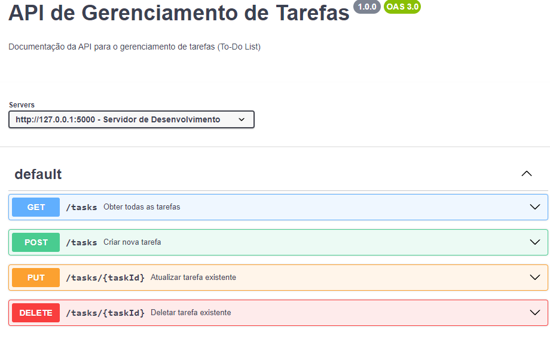

# tasks-Flask-CRUD

<h1 align="center"> To-do List </h1>

Api de to-do list criado com Flask e testes unitarios com pytest

  

## Tecnologias

Esse projeto foi desenvolvido com as seguintes tecnologias 

-Python
-Flask
-Pytest

## Projeto

Esse repositório foi criado durante o curso de Python na Rocketseat 

## :memo: Licença

Esse projeto está sob a lincença MIT
Feito por Vitor Pires